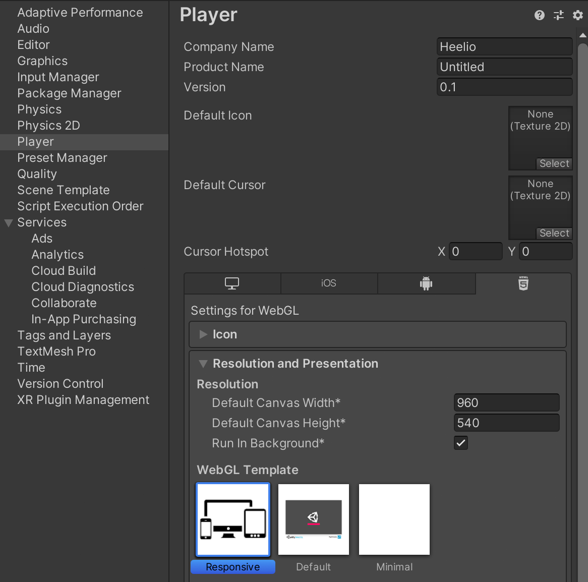

# UnityResponsiveWebGLTemplate
A simple, minimal responsive template for Unity WebGL builds. 

It automatically ajusts to fullscreen for any aspect ratio. 

## Installation

### Using packages

Simply download one of the available package depending on your Unity version : 
 - [:arrow_down: Unity 2019](Packages/ResponsiveWebGLTemplate_2019.unitypackage?raw=1)
 - [:arrow_down: Unity 2020](Packages/ResponsiveWebGLTemplate_2020.unitypackage?raw=1)

Then import it in your Unity project.

### From sources

 - Create a `/Assets/WebGLTemplates` directory in your Unity project
 - Clone or download the repository and copy `/Sources/<version>/Responsive` to your `WebGLTemplates` directory

 ## Usage

In your `Project Settings > Player` window, select the `WebGL Settings` tab (HTML5 logo). 

In the `Resolution and Presentation` section, choose `Responsive`. You're done!

